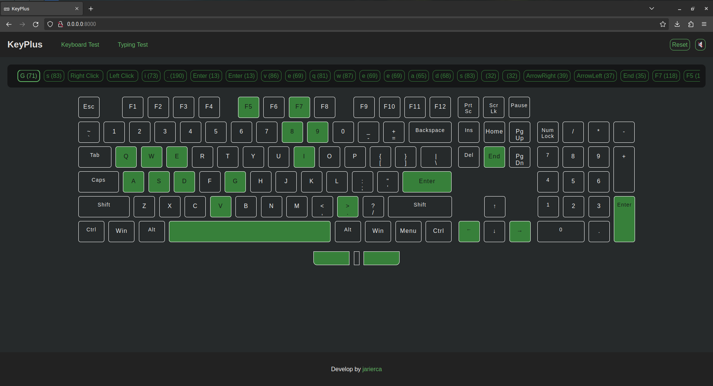
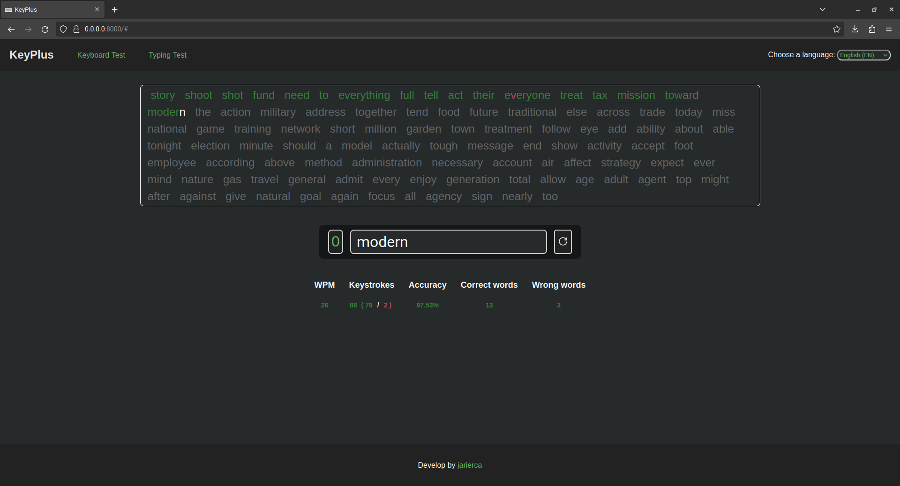

# KeyPulse 

## Description
This is a web application that provides two main features:

1. **Full-size Keyboard**: A full-size English keyboard is provided to test keyboard keys.
2. **Typing Test**: A typing test or typing speed test feature where users can practice typing and get a typing score within 30 seconds. The language for the test can be changed.

## Features
- Full-size English keyboard for testing keyboard keys.
- Typing test feature with customizable language options.
- Typing score calculation within 30 seconds.
- User-friendly interface.

## Technologies Used

The KeyPulse project has been developed using the following technologies:

- **HTML5**: For the structure and content of the web page.
- **CSS3**: For the design and styling of the user interface.
- **JavaScript (ES6+)**: For the application logic and page interactivity.
- **localStorage**: For local storage of user settings.
- **Git**: For version control of the source code.
- **GitHub**: For hosting the project repository and facilitating collaboration with other developers.

## Usage Instructions
1. Clone or download the repository to your local machine.
2. Open the `index.html` file in your web browser.
3. Use the full-size keyboard to test keyboard keys or take a typing test.
4. Customize the language for the typing test if needed.
5. Practice typing and improve your typing speed!
  
## Contribution

If you wish to contribute to the KeyPulse project, follow these steps:

1. Fork the repository on GitHub.
2. Clone your fork to your local machine.
3. Create a new branch for your contribution: `git checkout -b new-feature`.
4. Make the necessary changes and commit them with descriptive messages.
5. Push the changes to your GitHub repository: `git push origin new-feature`.
6. Create a pull request in the original repository for your changes to be reviewed.

## License

This project is licensed under the GNU General Public License v3.0 (GPL-3.0). See the [LICENSE](LICENSE) file for more details.

## Privacy

The KeyPlus application respects your privacy and does not collect any user data. The application solely utilizes the browser's local storage functionality to store tasks and lists locally on your device for your convenience. We are committed to maintaining your privacy and ensuring a secure and transparent user experience.

### Open Source and Freedom

KeyPulse is an open-source project distributed under the GNU General Public License v3.0 (GPL-3.0). This means that the source code is freely available for anyone to view, modify, and distribute. We believe in the principles of freedom and transparency, and we welcome contributions from the community to improve and enhance the application.

### FLOSS (Free/Libre and Open Source Software)

KeyPulse is part of the FLOSS movement, promoting the use of software that gives users the freedom to run, study, share, and modify it according to their needs. We advocate for open standards, interoperability, and user empowerment, and we invite users to join us in embracing and supporting FLOSS projects.

